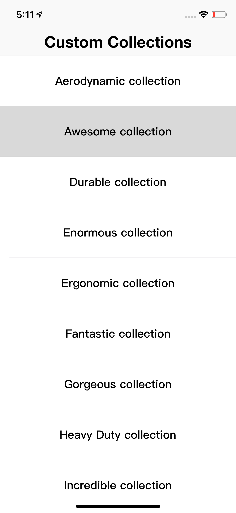
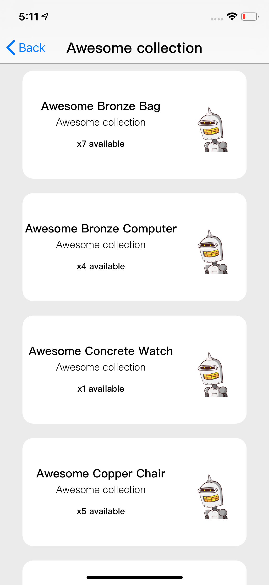

# Shopify

</img>
</img>

### Overview 

This repository contains the challenge code for the 2019 iOS Engineer Internship at Shopify. Repo should only be used by managers and recruiters @Shopify for assessment purposes.

### Getting Started

`` git clone https://github.com/MediBoss/Shopify.git``

Install all the Pods

`` pod install ``

### Engineer

* **Medi Assumani** - *iOS Engineer*
