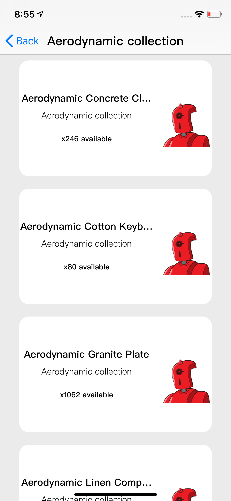

# Shopify

### Overview 

This repository contains the challenge code for the 2019 iOS Engineer Internship at Shopify. Repo should only be used by managers and recruiters @Shopify for assessment purposes.

### Screenshots

</img>
</img>

### Getting Started

`` git clone https://github.com/MediBoss/Shopify.git``

Install all the Pods

`` pod install ``

### Engineer
* **Medi Assumani** - *iOS Engineer*

### File/Folder Architecture

``
.
├── _config.yml
├── _drafts
|   ├── begin-with-the-crazy-ideas.textile
|   └── on-simplicity-in-technology.markdown
├── _includes
|   ├── footer.html
|   └── header.html
├── _layouts
|   ├── default.html
|   └── post.html
├── _posts
|   ├── 2007-10-29-why-every-programmer-should-play-nethack.textile
|   └── 2009-04-26-barcamp-boston-4-roundup.textile
├── _data
|   └── members.yml
├── _site
└── index.html

``

### Built with

* Swift 4.2 - Core application
* Xcode - main IDE
* KingFisher - Image downloading and caching
